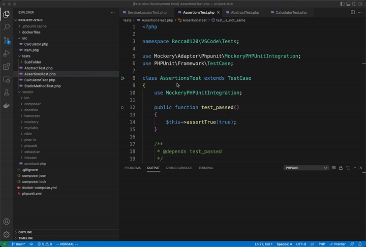

# PHPUnit for VSCode

Run your PHPUnit tests in Node using the Test Explorer UI.



## Features

- Shows a Test Explorer in the Test view in VS Code's sidebar with all detected tests and suites and their state
- Shows a failed test's log when the test is selected in the explorer
- Lets you choose test suites or individual tests in the explorer that should be run automatically after each file
  change

## Extension Settings

Include if your extension adds any VS Code settings through the `contributes.configuration` extension point.

This extension contributes the following settings:

- `phpunit.php`: Absolute path to php. Fallback to global php if it exists on the command line.
- `phpunit.phpunit`: Path to phpunit. Can be the phpunit file or phpunit.phar.\n\nAutomatically finds it in common
  places:\n - Composer vendor directory\n - phpunit.phar in your project\n - phpunit (or phpunit.bat for windows)
  globally on the command line
- `phpunit.command`: Custom command to run. Ex: `docker exec -t container_name`.
- `phpunit.args`: Any phpunit args (phpunit --help) E.g. --configuration ./phpunit.xml.dist

## Commands

The following commands are available in VS Code's command palette, use the ID to add them to your keyboard shortcuts:

- `phpunit.reload`: PHPUnit: Reload tests
- `phpunit.run-all`: PHPUnit: Run all tests
- `phpunit.run-file`: PHPUnit: Run tests in current file
- `phpunit.run-test-at-cursor`: PHPUnit: Run the test at the current cursor position
- `phpunit.rerun`: PHPUnit: Repeat the last test run

## Remote Configuration

### Docker

```json5
{
  "phpunit.command": 'docker run --rm -t -v ${pwd}:/app -w /app php:latest php',
  "phpunit.php": "php",
  "phpunit.phpunit": "vendor/bin/phpunit",
  "phpunit.args": [
    "-c",
    "phpunit.xml"
  ],
  "phpunit.paths": {
    // ${pwd} (current directory) is mounted to /app
    "${workspaceFolder}": '/app',
    // ${workspaceFolder} is mapped to /app
  },
}
```

### Ssh

```json5
{
  "phpunit.command": "ssh -i dockerfiles/sshd/id_rsa -p 2222 root@localhost -o StrictHostKeyChecking=no",
  "phpunit.php": "php",
  "phpunit.phpunit": "/app/vendor/bin/phpunit",
  "phpunit.args": [
    "-c",
    "/app/phpunit.xml"
  ],
  "phpunit.paths": {
    // ${pwd} (current directory) is mounted to /app
    "${workspaceFolder}": '/app',
    // ${workspaceFolder} is mapped to /app
  }
}
```

## Troubleshooting