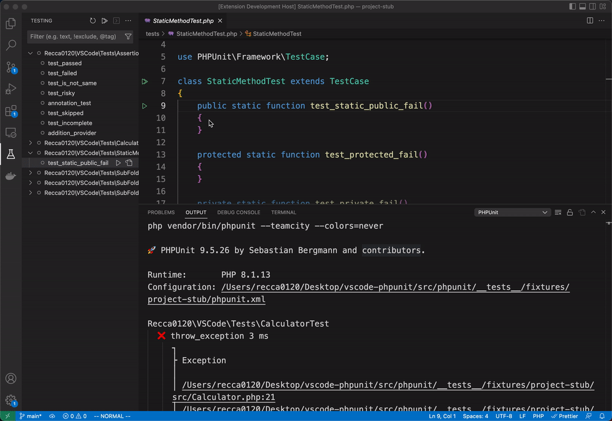
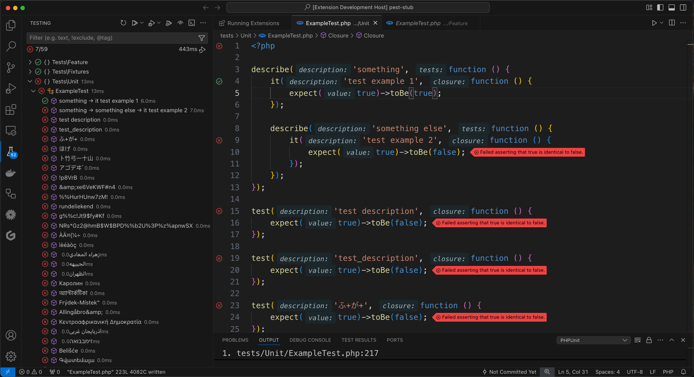

# PHPUnit & Pest Test Explorer

[](https://marketplace.visualstudio.com/items?itemName=recca0120.vscode-phpunit)
[](https://marketplace.visualstudio.com/items?itemName=recca0120.vscode-phpunit)

Run your PHPUnit OR Pest tests in Node using the Test Explorer UI.





## Features

- Shows a Test Explorer in the Test view in VS Code's sidebar with all detected tests and suites and their state
- Shows a failed test's log when the test is selected in the explorer
- Lets you choose test suites or individual tests in the explorer that should be run automatically after each file
  change

## Extension Settings

Include if your extension adds any VS Code settings through the `contributes.configuration` extension point.

This extension contributes the following settings:

- `phpunit.php`: Absolute path to php. Fallback to global php if it exists on the command line.
- `phpunit.phpunit`: Path to phpunit. Can be the phpunit file or phpunit.phar.\n\nAutomatically finds it in common
  places:\n - Composer vendor directory\n - phpunit.phar in your project\n - phpunit (or phpunit.bat for windows)
  globally on the command line
- `phpunit.command`: Custom command to run. Ex: `docker exec -t container_name`.
- `phpunit.args`: Any phpunit args (phpunit --help) E.g. --configuration ./phpunit.xml.dist
- `phpunit.environment`: Set environment variables before running the phpunit command, Ex: { "XDEBUG_MODE": "coverage" }
  or "XDEBUG_MODE=coverage"
- `phpunit.clearOutputOnRun`: True will clear the output when we run a new test. False will leave the output after every
  test.
- `phpunit.showAfterExecution`: Specify if the test report will automatically be shown after execution
- `phpunit.debuggerConfig`: Specify the debugger launch configuration

## Commands

The following commands are available in VS Code's command palette, use the ID to add them to your keyboard shortcuts:

- `phpunit.reload`: PHPUnit: Reload tests
- `phpunit.run-all`: PHPUnit: Run all tests
- `phpunit.run-file`: PHPUnit: Run tests in current file
- `phpunit.run-test-at-cursor`: PHPUnit: Run the test at the current cursor position
- `phpunit.rerun`: PHPUnit: Repeat the last test run

## Configuration

### [Laravel Artisan](https://laravel.com/docs/12.x/artisan)

```jsonc
{
  "phpunit.phpunit": "artisan test"
}
```

### [Laravel Sail](https://laravel.com/docs/12.x/sail)

```jsonc
{
  "phpunit.command": "docker compose exec -u sail laravel.test ${php} ${phpargs} ${phpunit} ${phpunitargs}",
  "phpunit.phpunit": "artisan test",
  "phpunit.paths": {
    "${workspaceFolder}": "/var/www/html",
  }
}
```

### [Pest](https://pestphp.com/)

```jsonc
{
  "phpunit.phpunit": "vendor/bin/pest"
}
```

### [ParaTest](https://github.com/paratestphp/paratest)

```jsonc
{
  "phpunit.phpunit": "vendor/bin/paratest"
}
```

### Docker

```jsonc
{
  "phpunit.command": "docker exec -t [container_id] /bin/sh -c \"${php} ${phpargs} ${phpunit} ${phpunitargs}\"",
  "phpunit.php": "php",
  "phpunit.phpunit": "vendor/bin/phpunit", 
  "phpunit.args": [
    "-c",
    "phpunit.xml"
  ],
  "phpunit.paths": {
    "${workspaceFolder}": "/app",
  },
}
```

```jsonc
{
  "phpunit.command": "docker run --rm -t -v ${PWD}:/app -w /app php:latest ${php} ${phpargs} ${phpunit} ${phpunitargs}",
  "phpunit.php": "php",
  "phpunit.phpunit": "vendor/bin/phpunit",
  "phpunit.args": [
    "-c",
    "phpunit.xml"
  ],
  "phpunit.paths": {
    "${workspaceFolder}": "/app",
  },
}
```

### Docker & Pest

```jsonc
{
  "phpunit.command": "docker exec -t [container_id] /bin/sh -c \"${php} ${phpargs} ${phpunit} ${phpunitargs}\"",
  "phpunit.php": "php",
  "phpunit.phpunit": "vendor/bin/pest", 
  "phpunit.args": [
    "-c",
    "phpunit.xml"
  ],
  "phpunit.paths": {
    "${workspaceFolder}": "/app",
  },
}
```

```jsonc
{
  "phpunit.command": "docker run --rm -t -v ${PWD}:/app -w /app php:latest ${php} ${phpargs} ${phpunit} ${phpunitargs}",
  "phpunit.php": "php",
  "phpunit.phpunit": "vendor/bin/pest",
  "phpunit.args": [
    "-c",
    "phpunit.xml"
  ],
  "phpunit.paths": {
    "${workspaceFolder}": "/app",
  },
}
```

### SSH

```jsonc
{
  "phpunit.command": "ssh -i dockerfiles/pest/id_rsa -p 2222 root@localhost -o StrictHostKeyChecking=no \"cd /app; ${php} ${phpargs} ${phpunit} ${phpunitargs}\"",
  "phpunit.php": "php",
  "phpunit.phpunit": "vendor/bin/phpunit",
  "phpunit.args": [
    "-c",
    "phpunit.xml"
  ],
  "phpunit.paths": {
    "${workspaceFolder}": "/app",
  }
}
```

### SSH & Pest

```jsonc
{
  "phpunit.command": "ssh -i dockerfiles/pest/id_rsa -p 2222 root@localhost -o StrictHostKeyChecking=no \"cd /app; ${php} ${phpargs} ${phpunit} ${phpunitargs}\"",
  "phpunit.php": "php",
  "phpunit.phpunit": "vendor/bin/pest",
  "phpunit.args": [
    "-c",
    "phpunit.xml"
  ],
  "phpunit.paths": {
    "${workspaceFolder}": "/app",
  }
}
```

## Troubleshooting

### PHPUnit path mapping not working

**Problem:**  
Path mapping with `${workspaceFolder}` does not work as expected.  
Example:

```json
{
  "phpunit.paths": {
    "${workspaceFolder}": "/app"
  }
}
```

Solution:
Replace ${workspaceFolder} with the actual project path.
For example:

```json
{
  "phpunit.paths": {
    "/myproject": "/app"
  }
}
```

### Running test with XDEBUG_TRIGGER env

When you have a PHP Xdebug launch configuration like this below:

```jsonc
{
    "version": "0.2.0",
    "configurations": [
        {
            "name": "Listen for Xdebug",
            "type": "php",
            "request": "launch",
            "port": 9003,
            "pathMappings": {
                "/var/www": "${workspaceRoot}"
            },
            "runtimeArgs": [
                "-dxdebug.mode=debug,develop",
            ]
        }
    ]
}
```

and you are using docker compose, setup the extension with the configuration below to enable debug if your `xdebug.ini`
configuration has `xdebug.start_with_request=trigger`:

```jsonc
 {
    "phpunit.command": "docker compose -f docker-compose.yml -f docker-compose.test.yml -f docker-compose.test.override.yml exec -e 'XDEBUG_TRIGGER=VSCODE' app bash -c",// "app" is the container name in the docker-compose.yml
    "phpunit.phpunit": "/var/www/artisan test --without-tty", //link to the Laravel artisan file in the container which is used to run the test
    "phpunit.paths": {
        "${workspaceFolder}": "/var/www"
    },
    "phpunit.debuggerConfig": "Listen for Xdebug",// This name of the launch configuration for PHP XDEBUG extension
}
```

Then you can run the test with the "Debug Test" icon button. You can also run the test using the "Run Test" icon but you
should have already started the Xdebug session from VSCode Debugger before running the test.
