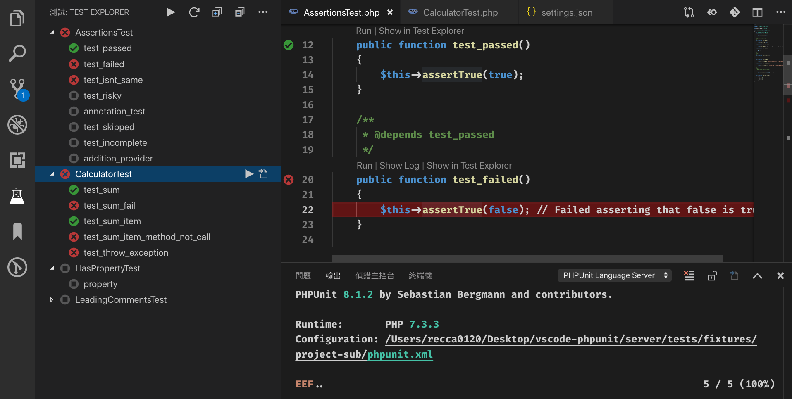

# PHPUnit Test Explorer for Visual Studio Code

Run your PHPUnit tests in Node using the
[Test Explorer UI](https://marketplace.visualstudio.com/items?itemName=hbenl.vscode-test-explorer).

## Features
* Shows a Test Explorer in the Test view in VS Code's sidebar with all detected tests and suites and their state
* Adds CodeLenses to your test files for starting and debugging tests
* Adds Gutter decorations to your test files showing the tests' state
* Adds line decorations to the source line where a test failed
* Shows a failed test's log when the test is selected in the explorer
* Lets you choose test suites or individual tests in the explorer that should be run automatically after each file change
* Forwards the console output from PHPUnit to a VS Code output channel

## Getting started
* Install the extension
* Restart VS Code and open the Test view
* Run your tests using the  icons in the Test Explorer or the CodeLenses in your test file

## Configuration

### Custom debugger configuration

### Other options

Property                           | Description
-----------------------------------|---------------------------------------------------------------
`testExplorer.codeLens`            | Show a CodeLens above each test or suite for running or debugging the tests
`testExplorer.gutterDecoration`    | Show the state of each test in the editor using Gutter Decorations
`testExplorer.onStart`             | Retire or reset all test states whenever a test run is started
`testExplorer.onReload`            | Retire or reset all test states whenever the test tree is reloaded

## Commands

The following commands are available in VS Code's command palette, use the ID to add them to your keyboard shortcuts:

ID                                 | Command
-----------------------------------|--------------------------------------------
`test-explorer.reload`             | Reload tests
`test-explorer.run-all`            | Run all tests
`test-explorer.run-file`           | Run tests in current file
`test-explorer.run-test-at-cursor` | Run the test at the current cursor position
`test-explorer.cancel`             | Cancel running tests

## Troubleshooting
