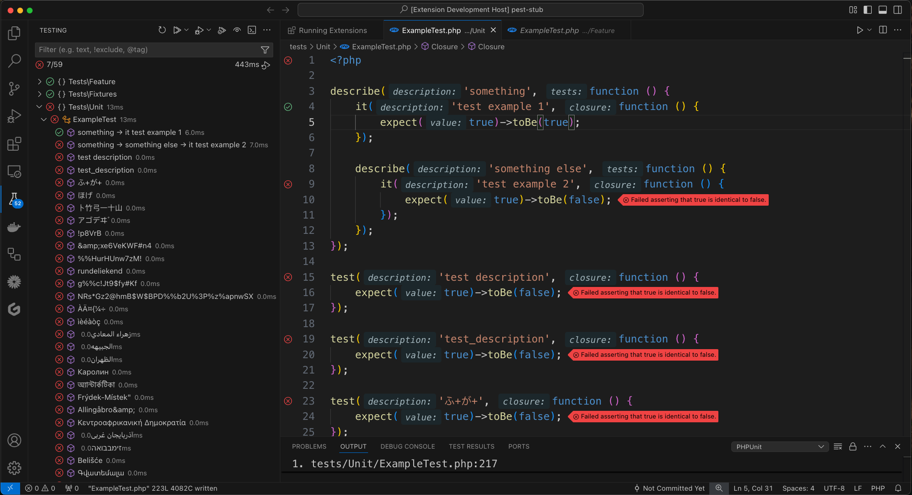

# PHPUnit & Pest Test Explorer for VS Code

[](https://marketplace.visualstudio.com/items?itemName=recca0120.vscode-phpunit)
[](https://marketplace.visualstudio.com/items?itemName=recca0120.vscode-phpunit)
[](LICENSE.md)

[English](README.md)

在 VS Code 中使用原生 Test Explorer 執行 [PHPUnit](https://phpunit.de/) 和 [Pest](https://pestphp.com/) 測試。


## 快速開始

1. 從 [VS Code Marketplace](https://marketplace.visualstudio.com/items?itemName=recca0120.vscode-phpunit) 安裝擴充套件
2. 開啟包含 `phpunit.xml` 或 `phpunit.xml.dist` 的 PHP 專案
3. 測試會自動顯示在側邊欄的 Test Explorer — 點擊即可執行

> PHPUnit 和 Pest 會自動從 `vendor/bin` 偵測，大部分專案不需要額外設定。

## 功能特色

- **Test Explorer 整合** — 從側邊欄探索、執行、偵錯測試
- **PHPUnit 7 – 12 & Pest 1 – 4** — 廣泛的版本支援
- **彩色輸出** — 語法高亮的測試結果，內嵌 PHP 原始碼片段
- **可點擊的堆疊追蹤** — 從錯誤輸出直接跳轉到 file:line
- **遠端環境** — 透過自訂命令支援 Docker、SSH、Laravel Sail、DDEV
- **平行執行** — 支援 ParaTest
- **Xdebug 偵錯** — 一鍵逐步偵錯
- **持續執行** — 檔案變更時自動執行測試



## 設定

將設定加入 `.vscode/settings.json`，所有設定使用 `phpunit.*` 前綴。

```jsonc
{
  // PHP 執行檔路徑（預設："php"）
  "phpunit.php": "php",

  // PHPUnit 或 Pest 執行檔路徑（預設："vendor/bin/phpunit"）
  "phpunit.phpunit": "vendor/bin/phpunit",

  // 自訂命令範本
  // 可用變數：${php}, ${phpargs}, ${phpunit}, ${phpunitargs}, ${phpunitxml}, ${cwd}
  "phpunit.command": "\"${php}\" ${phpargs} \"${phpunit}\" ${phpunitargs}",

  // 傳遞給 PHPUnit 的額外參數
  "phpunit.args": [],

  // 遠端環境路徑對應 { "本地路徑": "遠端路徑" }
  "phpunit.paths": {},

  // 執行前設定的環境變數
  "phpunit.environment": {},

  // 每次執行前清除輸出（預設：true）
  "phpunit.clearOutputOnRun": true,

  // 何時顯示輸出："always" | "onFailure" | "never"（預設："onFailure"）
  "phpunit.showAfterExecution": "onFailure",

  // 偵錯用的 launch.json 設定名稱
  "phpunit.debuggerConfig": "",

  // Xdebug 通訊埠，0 = 隨機（預設：0）
  "phpunit.xdebugPort": 0
}
```

## 設定範例

### 本地環境

大部分本地專案不需要任何設定。若要使用其他測試執行器：

```jsonc
// Pest
{ "phpunit.phpunit": "vendor/bin/pest" }

// Laravel Artisan
{ "phpunit.phpunit": "artisan test" }

// ParaTest（平行執行）
{ "phpunit.phpunit": "vendor/bin/paratest" }
```

### Docker

在 Docker 容器內執行測試需要設定兩件事：

1. **`phpunit.command`** — 告訴擴充套件如何在容器內執行命令
2. **`phpunit.paths`** — 將本地檔案路徑對應到容器路徑，讓擴充套件能定位測試檔案並解析錯誤輸出

> **注意：** `${workspaceFolder}` 在 macOS 或 WSL 上可能無法正確解析。若遇到路徑問題，請改用實際的絕對路徑（如 `/home/user/myproject`）。

**`docker exec`（已存在的容器）：**

```jsonc
{
  "phpunit.command": "docker exec -t my_container /bin/sh -c \"${php} ${phpargs} ${phpunit} ${phpunitargs}\"",
  "phpunit.paths": {
    "${workspaceFolder}": "/app"
  }
}
```

**`docker run`（一次性容器）：**

```jsonc
{
  "phpunit.command": "docker run --rm -t -v ${PWD}:/app -w /app php:latest ${php} ${phpargs} ${phpunit} ${phpunitargs}",
  "phpunit.paths": {
    "${workspaceFolder}": "/app"
  }
}
```

**Docker Compose：**

```jsonc
{
  "phpunit.command": "docker compose exec -t app /bin/sh -c \"${php} ${phpargs} ${phpunit} ${phpunitargs}\"",
  "phpunit.paths": {
    "${workspaceFolder}": "/app"
  }
}
```

若 `docker-compose.yml` 不在工作區根目錄，使用 `-f` 旗標指定：

```jsonc
{
  "phpunit.command": "docker compose -f /path/to/docker-compose.yml exec -t app /bin/sh -c \"${php} ${phpargs} ${phpunit} ${phpunitargs}\""
}
```

### Laravel Sail

```jsonc
{
  "phpunit.command": "docker compose exec -u sail laravel.test ${php} ${phpargs} ${phpunit} ${phpunitargs}",
  "phpunit.phpunit": "artisan test",
  "phpunit.paths": {
    "${workspaceFolder}": "/var/www/html"
  }
}
```

### SSH

```jsonc
{
  "phpunit.command": "ssh user@host \"cd /app; ${php} ${phpargs} ${phpunit} ${phpunitargs}\"",
  "phpunit.paths": {
    "${workspaceFolder}": "/app"
  }
}
```

### DDEV

```jsonc
{
  "phpunit.command": "ddev exec ${php} ${phpargs} ${phpunit} ${phpunitargs}"
}
```

### WSL + Docker

從 WSL 工作區使用 Docker 時，本地路徑需使用完整的 WSL 路徑：

```jsonc
{
  "phpunit.command": "docker exec -t my_container /bin/sh -c \"${php} ${phpargs} ${phpunit} ${phpunitargs}\"",
  "phpunit.paths": {
    "//wsl.localhost/Ubuntu/var/www/myproject": "/var/www/myproject"
  }
}
```

## Xdebug 偵錯

1. 在 `.vscode/launch.json` 加入偵錯設定：

    ```jsonc
    {
      "name": "Listen for Xdebug",
      "type": "php",
      "request": "launch",
      "port": 9003,
      "pathMappings": {
        "/app": "${workspaceFolder}"
      }
    }
    ```

2. 在擴充設定中指定該設定名稱：

    ```jsonc
    {
      "phpunit.debuggerConfig": "Listen for Xdebug"
    }
    ```

3. 在 Test Explorer 中點擊 **Debug Test** 按鈕。

**在 Docker 中使用 `xdebug.start_with_request=trigger`：**

```jsonc
{
  "phpunit.command": "docker compose exec -e XDEBUG_TRIGGER=VSCODE app bash -c \"${php} ${phpargs} ${phpunit} ${phpunitargs}\"",
  "phpunit.debuggerConfig": "Listen for Xdebug"
}
```

**中斷點沒有被觸發？** 請確認：
- Xdebug 已設定 `xdebug.mode=debug` 及 `xdebug.start_with_request=yes`（或 `trigger`）
- `phpunit.debuggerConfig` 與 `launch.json` 中的**名稱完全一致**
- `launch.json` 中的 `pathMappings` 正確對應容器路徑與本地路徑
- Xdebug 埠號未被防火牆封鎖

## 指令

| 指令 | 說明 | 快捷鍵 |
|---|---|---|
| `phpunit.reload` | 重新載入測試 | — |
| `phpunit.run-all` | 執行所有測試 | `Cmd+T Cmd+S` |
| `phpunit.run-file` | 執行目前檔案的測試 | `Cmd+T Cmd+F` |
| `phpunit.run-test-at-cursor` | 執行游標位置的測試 | `Cmd+T Cmd+T` |
| `phpunit.run-by-group` | 依群組執行測試 | — |
| `phpunit.rerun` | 重複上次測試 | `Cmd+T Cmd+L` |

## 疑難排解

<details>
<summary><code>${workspaceFolder}</code> 解析為 <code>/</code></summary>

在部分系統（macOS、WSL）上，`${workspaceFolder}` 可能無法正確解析。請在 `phpunit.paths` 中改用實際的絕對路徑：

```jsonc
{
  "phpunit.paths": {
    "/home/user/myproject": "/app"
  }
}
```
</details>

<details>
<summary><code>spawn ${php} ENOENT</code></summary>

通常是因為其他擴充套件（如 [DEVSENSE PHP Tools](https://marketplace.visualstudio.com/items?itemName=DEVSENSE.phptools-vscode)）將 `${php}` 作為字面變數注入環境所導致。修正方式：

```jsonc
{
  "phpunit.command": ""
}
```

若仍無法解決，請停用衝突的 PHP 擴充套件，然後先啟用 **PHPUnit Test Explorer**，再啟用其他擴充套件。
</details>

<details>
<summary>路徑包含空白導致錯誤</summary>

確認 `phpunit.command` 範本中的變數有加引號（這是預設值）：

```jsonc
{
  "phpunit.command": "\"${php}\" ${phpargs} \"${phpunit}\" ${phpunitargs}"
}
```
</details>

## 貢獻

發現問題？有想法？歡迎貢獻！

- [回報問題](https://github.com/recca0120/vscode-phpunit/issues/new?template=bug_report.yml)
- [功能建議](https://github.com/recca0120/vscode-phpunit/issues/new?template=feature_request.yml)
- [貢獻指南](CONTRIBUTING.md)

## 授權

[MIT](LICENSE.md)
